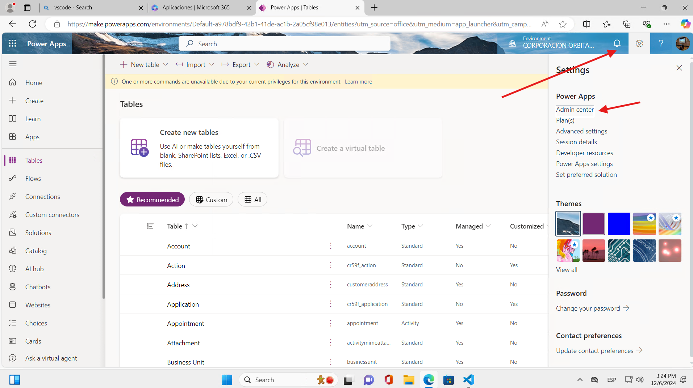

Abrir el Link Para acceder Microsoft  365  https://www.office.com/ 

Ahora nos mostrata el Longin y podemos ingresar a nuestra sesion 

Accemos Aplicaciones y despues hacemos clic en Power Apps 

Podemos acceder directamente a Power Apps con esta Link:  https://make.powerapps.com/

### Paso Acceder a la plataforma de Admin center 
En la página principal de Power Apps, selecciona "Settings".
En la barra lateral izquierda haz clic en "Admin Center".
Ingresa un nombre para tu entorno, selecciona la región y asegúrate de que el entorno esté configurado como "Desarrollador".
Selecciona "Crear". Esto creará un nuevo entorno de Power Apps.

### Paso 2: Crear un Nuevo Entorno
- En la barra lateral izquierda, selecciona **"Entornos"**.
- Haz clic en el botón **"+" (Nuevo)** en la parte superior de la pantalla para crear un nuevo entorno.

### Paso 3: Completar la Información del Entorno
En el panel derecho, se abrirán las opciones para configurar el nuevo entorno:
   
- **Nombre**: Especifica el nombre del entorno. En este caso, se ha escrito **"PL Development"**. Elige un nombre que sea representativo para el propósito del entorno.
- **Región**: Selecciona la región en la que deseas que se cree el entorno. La región seleccionada en la imagen es **"United States - Default"**. Escoge la región más cercana a tus usuarios para mejorar el rendimiento.
- **Obtener nuevas funciones temprano**: Puedes elegir activar esta opción para obtener acceso anticipado a nuevas características. En este caso, está desactivada (Opción apagada).
- **Tipo**: Selecciona **"Desarrollador"** para crear un entorno de desarrollo. Esto permite un entorno con licencias de uso para desarrolladores y recursos limitados. 
- **Propósito**: En esta sección puedes describir el propósito del entorno, como "Desarrollo de aplicaciones" o "Pruebas". Es opcional, pero puede ser útil para organizar múltiples entornos.
- **¿Agregar un almacén de datos de Dataverse?**: Debes seleccionar **"Sí"** para habilitar **Dataverse**, que es el almacenamiento de datos utilizado en Power Apps y otros productos de la plataforma. Esto es necesario para un entorno de tipo **Desarrollador**.

### Paso 4: Confirmar y Continuar
- Después de ingresar todos los datos, haz clic en el botón **"Next" (Siguiente)** en la parte inferior del panel derecho.
- En este punto, el entorno será creado con la configuración indicada.

### Paso 5: Completar la Configuración
- Una vez creado, puedes empezar a usar el entorno para desarrollar aplicaciones y almacenar datos. También puedes gestionar las tablas de Dataverse, configurar permisos y agregar más recursos o usuarios según sea necesario.

