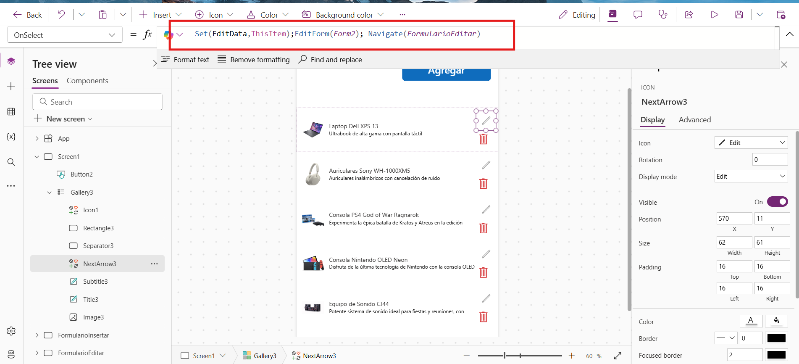

## PASO 1 Creacion de una base de datos SQL Database. 

https://learn.microsoft.com/en-us/azure/azure-sql/database/single-database-create-quickstart?view=azuresql&tabs=azure-portal


```SQL

CREATE TABLE Productos (
    ProductoID INT IDENTITY(1,1) PRIMARY KEY,  -- Identificador único autoincremental
    Nombre NVARCHAR(100) NOT NULL,            -- Nombre del producto
    Descripcion NVARCHAR(255) NULL,           -- Descripción del producto
    Precio DECIMAL(10,2) NOT NULL,            -- Precio del producto con 2 decimales
    CantidadEnStock INT NOT NULL,             -- Cantidad disponible en stock
    FechaCreacion DATETIME DEFAULT GETDATE(), -- Fecha de creación (por defecto, la fecha actual)
    Activo BIT DEFAULT 1                      -- Indicador de si el producto está activo
);


-- Insertar datos de ejemplo en la tabla Productos
INSERT INTO Productos (Nombre, Descripcion, Precio, CantidadEnStock, Activo)
VALUES
('Laptop Dell XPS 13', 'Ultrabook de alta gama con pantalla táctil', 1499.99, 25, 1),
('Auriculares Sony WH-1000XM5', 'Auriculares inalámbricos con cancelación de ruido', 349.99, 100, 1),
('Monitor Samsung 4K', 'Monitor UHD 27 pulgadas para trabajo y gaming', 399.50, 50, 1),
('Teclado mecánico Logitech', 'Teclado mecánico RGB con switches rojos', 120.00, 75, 1),
('Mouse inalámbrico Microsoft', 'Mouse ergonómico para oficina', 29.99, 150, 1),
('Impresora HP LaserJet', 'Impresora láser para oficina', 220.00, 20, 1),
('Disco Duro Externo WD', 'Disco duro de 2TB con conexión USB 3.0', 89.99, 60, 1),
('Cámara Canon EOS R6', 'Cámara profesional de fotografía y video', 2499.00, 10, 1),
('Parlantes Bose SoundLink', 'Parlantes Bluetooth portátiles', 199.00, 30, 1),
('Tablet Apple iPad Air', 'Tableta ligera con pantalla Retina', 599.99, 40, 1);

```

## Paso 2 Crear un proyecto en blanco de Lienzo


## Paso 3 Agregar la conexion hacia la base de datos


Se ingresan los datos del conexionString de la base de datos


## PASO 4  Agregar un verticalGallery de Power apps 


## PASO 5 Agregar columna imagen en la tabla Productos 

Para agregar una nueva columna a la tabla `Productos` que almacene la URL de una imagen, puedes usar el comando `ALTER TABLE`. Además, si deseas eliminar todos los datos antes de modificar la tabla, puedes usar `TRUNCATE TABLE`.

Aquí tienes los pasos:

### **1. Eliminar los datos de la tabla (opcional)**
Si deseas vaciar la tabla antes de realizar el cambio:
```sql
TRUNCATE TABLE Productos;
```

### **2. Agregar la nueva columna**
Para agregar una columna `ImagenURL` que almacene la URL de la imagen:
```sql
ALTER TABLE Productos
ADD ImagenURL NVARCHAR(500) NULL; -- Permite almacenar una URL de hasta 500 caracteres
```

### **3. Verificar la estructura de la tabla**
Para confirmar que la nueva columna ha sido añadida correctamente:
```sql
EXEC sp_help 'Productos'; -- Muestra la estructura de la tabla
```

### **4. Insertar datos con la nueva columna**
Una vez agregada la columna, puedes incluir valores para la nueva columna al insertar datos:
```sql

INSERT INTO Productos (Nombre, Descripcion, Precio, CantidadEnStock, ImagenURL)
VALUES
('Laptop Dell XPS 13', 'Ultrabook de alta gama con pantalla táctil', 1499.99, 25, 'https://computodo.com.sv/wp-content/uploads/2024/03/Dell-XPS-13-Plus-9320-Core-i7.jpg'),
('Auriculares Sony WH-1000XM5', 'Auriculares inalámbricos con cancelación de ruido', 349.99, 100, 'https://buketomnisportpweb.s3.us-east-2.amazonaws.com/products-images/8aYuEQ2SxiQELceSJ1rPNswB6FrnpUXUOTbcMsz9.jpeg'),
('Consola PS4 God of War Ragnarok' ,  'Experimenta la épica batalla de Kratos y Atreus en la edición especial de God of War Ragnarok para PS4.', 599.00 , 50 , 'https://buketomnisportpweb.s3.us-east-2.amazonaws.com/products-images/YGnUsQyfa7RJVuSu7yfIHyLAjynmzcuobGNlE1Sn.png'),
('Consola Nintendo OLED Neon' ,  '', 419.00 , 30 , 'https://buketomnisportpweb.s3.us-east-2.amazonaws.com/products-images/EoygGvFvKPrygdC8qtuxfeWRRAG8722FdZb03ysW.jpeg') , 
('Equipo de Sonido CJ44' ,  '', 209.00 , 45 , 'https://buketomnisportpweb.s3.us-east-2.amazonaws.com/products-images/073399800.1492708431.jpg'),
('Equipo de sonido MHC-V13' ,  'Lleva las fiestas al siguiente nivel y convierte cumpleaños, ocasiones especiales y reuniones improvisadas en un festival.', 209.00 , 65 , 'https://buketomnisportpweb.s3.us-east-2.amazonaws.com/products-images/z10nekYqGki5vUMg1jI3wSvIRRQBn1moBYpBqeXr.jpeg'),
('Teléfono GALAXY S23 SM-S911 Negro' ,  '', 859.00 , 50 , 'https://buketomnisportpweb.s3.us-east-2.amazonaws.com/products-images/5bdeGl6sZ1RQRRVLca2JeGomk7KGFAlahY9uHbgH.png');

UPDATE [dbo].[Productos]
SET Descripcion = 'Experimenta la épica batalla de Kratos y Atreus en la edición especial de God of War Ragnarok para PS4.'
WHERE Nombre = 'Consola PS4 God of War Ragnarok';

UPDATE [dbo].[Productos]
SET Descripcion = 'Disfruta de la última tecnología de Nintendo con la consola OLED Neon, ideal para juegos portátiles y de sala.'
WHERE Nombre = 'Consola Nintendo OLED Neon';

UPDATE [dbo].[Productos]
SET Descripcion = 'Potente sistema de sonido ideal para fiestas y reuniones, con conectividad Bluetooth.'
WHERE Nombre = 'Equipo de Sonido CJ44';

UPDATE [dbo].[Productos]
SET Descripcion = 'Teléfono de gama alta con cámara de última generación, pantalla AMOLED y un diseño elegante en color negro.'
WHERE Nombre = 'Teléfono GALAXY S23 SM-S911 Negro';

```

### **5. Actualizar los datos existentes**
Si ya tienes datos en la tabla y deseas actualizar la nueva columna con valores:
```sql
UPDATE Productos
SET ImagenURL = 'https://example.com/images/default.jpg'
WHERE ImagenURL IS NULL;
```

### Resultado Final
La tabla ahora tiene una nueva columna `ImagenURL` donde puedes almacenar las URLs de las imágenes asociadas a los productos.

쯅ecesitas ayuda con algo más? 游땕


# Paso Siguente Crear boton de agregar Productos 


Agregar la siguente formula  


Se va agregar la siguente Screend con el mismo nombre en blanco 


El siguente paso 

Insertar un nuevo componente de Power Apps Edit form 
para agregar campos  sera en las propiedades Fields 
Modo Editar


Agregamos un nuevo componente con la siguentes lineas de codigo 
Hacemos un submit al formulario actual esto nos permite basicamente enviar la informacion 
Despues muestra noticiaciones dependiendo el caso.


# Editar formulario 
Necesitamos la siguente formula  

``` bash
Set(EditData,ThisItem);EditForm(Form2); Navigate(FormularioEditar)

```
Esta formula  nos dice que queremos el formulario como editar  y que nos envie al formulario Editar  
Claro pero no existe hay que hacer la nueva screen 




El nuevo formulario siempre sera editable  pero esta vez en Item tiene que ser EditData ya que donde almacenamos y seteamos la informacion   


El boton tiene que ser siempre Submit a el formuario Form2 ya que es un nuevo formulario que se genera 


# Eliminar  el Item 

Agregamos un nuevo icono de Drash para eliminar y colocamos la siguente eliminar de el datasource  y el items seleccionado 

